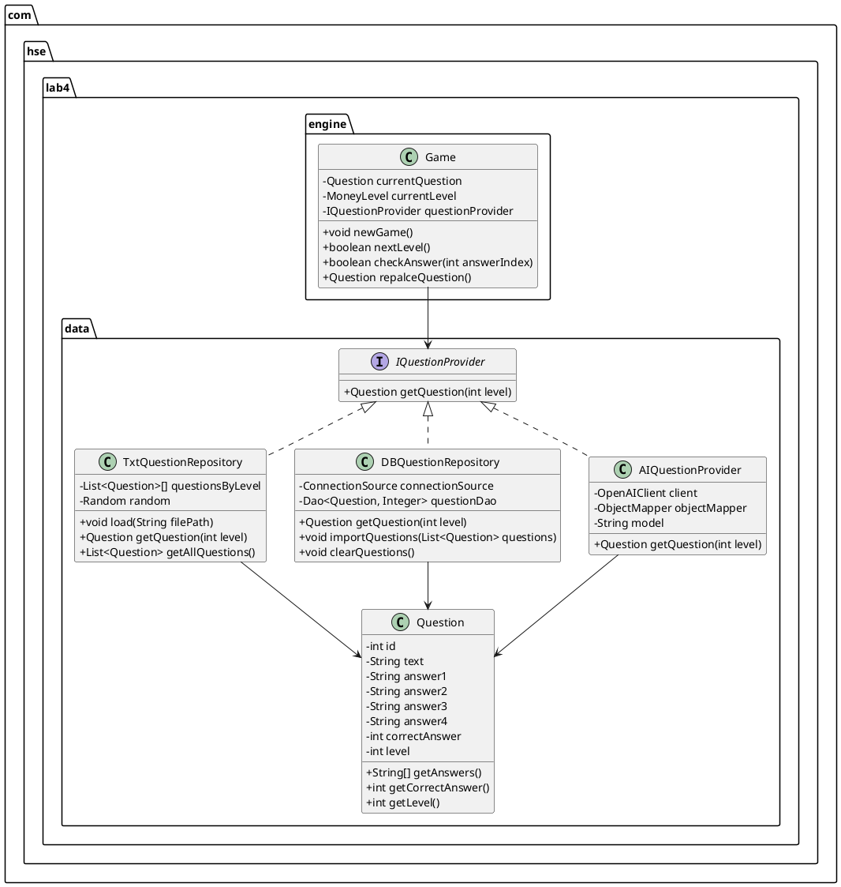
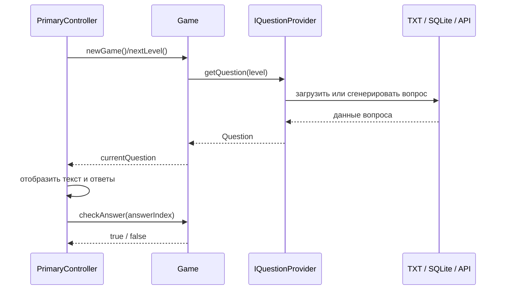
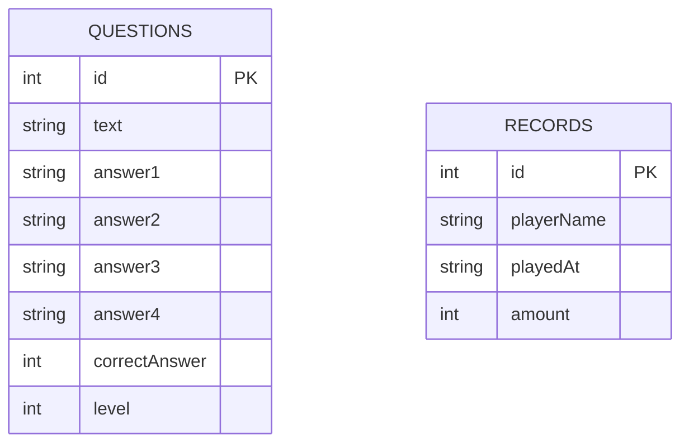

# Лабораторная работа 4. Игра «Кто хочет стать миллионером?»

## Задача

Цель работы — реализовать настольное приложение по мотивам телевизионного шоу «Кто хочет стать миллионером?». В программе игрок последовательно отвечает на 15 вопросов возрастающей сложности. Каждый вопрос содержит 4 варианта ответа, из которых только один является правильным. Время ответа не ограничено.

Основные задачи работы:

1. Реализовать игровой процесс и возможности, описанные в методических рекомендациях.
2. Реализовать хранение вопросов игры в базе данных SQLite.
3. Реализовать хранение таблицы рекордов в базе данных и вывод лучших результатов.
4. Реализовать возможность динамической генерации вопросов средствами генеративного ИИ через подключение к API.

## Модель данных

Для отделения игровой логики от конкретного способа получения вопросов введён общий интерфейс `IQuestionProvider`.



Контроллер `PrimaryController` связывает пользовательский интерфейс с игровым движком. `Game` отвечает за текущий уровень, текущий вопрос, проверку ответа и переход к следующему уровню. Репозитории в пакете `data` отвечают за получение и сохранение данных.

## Диаграмма последовательности получения вопроса



## Хранение вопросов в SQLite

Для таблицы вопросов используется класс `Question`. Репозиторий `DBQuestionRepository` создаёт таблицу при запуске и предоставляет два основных сценария:

1. получение случайного вопроса по уровню сложности;
2. импорт набора вопросов из текстового файла.

Для сохранения результатов используется класс `DBRecordRepository`. При окончании игры, победе или добровольном завершении с выигрышем приложение запрашивает имя игрока и сохраняет результат.



Таблицы не связаны внешними ключами: вопросы используются в игровом процессе, а записи рекордов фиксируют независимые результаты прохождений.

## Сборка и запуск

Для сборки и запуска проекта используется Maven.
Для режима ИИ перед запуском необходимо установить переменную окружения `MILLIONAIRE_API_KEY`.

```bash
mvn clean javafx:run
```
